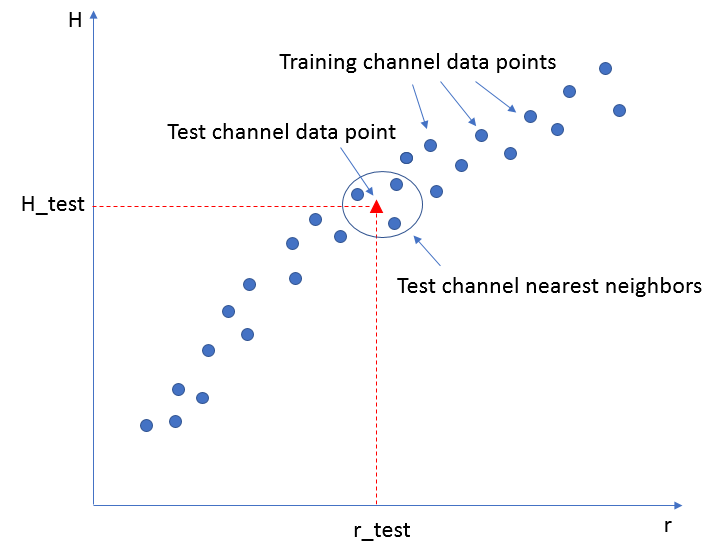

# ML5G-PHY Challenge Report - Redline Team
\
### October 28, 2020

\
\
\

#### Redline Team Members:
#### • Ali Arad,                           
#### • Felix Dujmenovic,            
#### • Brad Stimpson,                   
#### • Manbir Kaur               

#### Contacts: aarad@rdlcom.com, fdujmenovic@rdlcom.com  

\
\
\

# 1	INTRODUCTION

This document briefly describes the approach we took to tackle this channel estimation challenge. The proposed solution is implemented using MATLAB. The source code of the algorithm as well as the modified script we used to generate the training datasets are provided along with this document. We also provided link to a OneDrive folder where the estimated channel matrix files are available for download.

# 2	TRAINING DATASET GENERATION

Due to memory limitation, we could not directly use the MATLAB scripts provided to generate training dataset for 10,000 channels. To resolve this issue, we modified the script to generate the training datasets for 1000 channels at a time. We generated 10 sets of training data, each one containing 1000 channels. For each set, we created two MAT files: one containing received pilot symbols (*r*) and the other one containing the channel matrix (*H*) for 1000 channels. Our modified script generated the following files for each data set case:

-	RXpilot_SNRx_Nc1000_y_R.mat	*R* array containing *Rx* pilots for 1000 channels
-	RXpilot_SNRx_Nc1000_y_H.mat	Hall array containing *H* matrix for 1000 channels

where *x* is the data_set value (1, 2 or 3) corresponding to SNR of training sets, and y is the set number (1 to 10) for the 10 sets each with 1000 channels.

Training datasets for each of the 9 test scenarios are stored in separate folders named as “dataset*x_n*”, where *x* indicates the SNR index as described above, and n is the number of training symbols (*Ntrain*).

Our modified script for training data generation is included in this repository (*gen_RXtraining_SNR_Raymobtime_nset.m* file). We also included the revised function provided for channel matrix generation (*gen_channel_ray_tracing_rev.m* file).

# 3	CHANNEL ESTIMATION ALGORITHM

Our proposed solution is based on K-Nearest Neighbor (KNN) machine learning algorithm. Here is the basic idea behind this algorithm: For training channels we have the received pilots (*r*) and the channel matrix (*H*). For test channels, we only have *r* and want to estimate *H* based on the existing training data. This estimation problem is similar to a regression problem where we have 10,000 sets of (*r, H*) data points for training channels, and we want to estimate the *H* for a test channel using its *r*. The algorithm tries to find the nearest neighbors for the test channel *r* (referred to as *r_test* here) among the existing training channel *r*’s (*r_training*’s). After finding the right neighborhood for the test channel using KNN algorithm on *r*, the proposed solution speculates that the same neighborhood is also valid for *H*. In other words, the algorithm assumes that the training channels that are the nearest neighbors to a test channel based on *r* are also its nearest neighbors based on *H*. Based on this speculation, the algorithm estimates the *H* of a test channel (*H_test*) based on the *H*’s of training channels in its neighborhood determined based on its *r*. The basic concept of the proposed solution is demonstrated in Figure 1.

**Figure 1 Basic concept of using nearest neighbors in channel estimation**

Details of the implemented algorithm are described in following sections.

## 3.1	KNN algorithm for r
We use KNN algorithm to find nearest neighbor of a test channel by comparing its *r_test* with the *r* of training channels in each training data set. The distance between *r_test* and *r* of a training channel is defined as the Normalized Mean Square Error (NMSE) between these two arrays. The KNN algorithm calculates NMSE between *r_test* and *r* of each training channel in a training set (containing 1000 channels), and identifies *K* nearest neighbor training channels with the least NMSE value. In our implementation we used *K*=5 to find the 5 nearest training channels in each set. 

## 3.2	KNN across multiple training datasets
It was mentioned earlier that due to memory limitation, the 10,000 training channels are divided into 10 sets of 1000 channels. KNN algorithm across all training sets is done in two steps. Frist we apply KNN in each set to find the *K* nearest neighbors in that set. For each set we record the channel index and the corresponding NMSE for *K* nearest neighbors of *r_test*. Then we determine the top *K* training channels that have the lowest NMSE across all sets. We record the channel indices of these channels along with their corresponding *r* NMSE – this set represents the overall nearest neighbors of the given test channel.  

## 3.3	KNN algorithm per subcarrier
The channel matrix *H* for each channel is composed of the channel matrices per each subcarrier (*Hk*). For this problem with 256 subcarriers, we have 256 *Hk*’s in each H. Since the mmWave channel is frequency selective, *Hk*’s are different across frequency. Accordingly, the proposed algorithm performs channel estimation per subcarrier. This is done by performing KNN algorithm per subcarrier. Each *r_test* is composed of pilot symbols received across various subcarriers (*r_testk*). We apply KNN per subcarrier for each *r_testk* to find its nearest neighbors. The outcome of this process is a list of channel indices of the *K* nearest training channels per subcarrier. Our investigation shows that this channel estimation approach performs better than applying KNN across all subcarriers together.

## 3.4	Reducing Noise Impact
### 3.4.1	KNN on higher power symbols

The first step we took to reduce the impact of noise in nearest neighbor selection is to determine a subset of Rx pilot symbols in *r_test* with the a higher power. For each subcarrier, the algorithm calculates the power of Rx pilot symbols in *r_test* and determines symbol indices for a subset (in this case half) of symbols with the stronger power. KNN algorithm would only be applied across those higher power symbols. This reduces the chance of wrong neighbor selection due to weaker (and likely noisy) Rx pilot symbols.

### 3.4.2	Noise reduction with filtering

In very low SNR situations (e.g. SNRs below -6 dB), the Rx pilot signal is polluted with a much stronger noise signal. If we apply KNN on the raw Rx pilot signal, we end up with a wrong neighbor selection as the *r* signal is dominated by noise. To reduce the impact of noise in such cases, we apply a moving average filter to *r* across the frequency domain. The proposed algorithm uses a window size of 11 subcarriers for this moving average filter. Our investigation shows that such filtering improves the channel estimation performance in low SNR situations.

## 3.5	Channel Estimation

After identifying the nearest neighbors using KNN algorithm, we calculate the estimated channel matrix using a weighted average of the H’s of nearest neighbors. As in the KNN algorithm, this is done per subcarrier. For each subcarrier, the proposed algorithm identifies the channel index and the NMSE of *rk* for *K* nearest neighbors. Given that *H* matrices of nearest neighbors per each subcarrier (*Hk*’s) are all known in training data, we from a weighted average of nearest neighbor *Hk*’s. The weight of each neighbor channel is proportional to the square of inverse of its NMSEr (weights are normalized so that their sum is one). With this weighting the closer neighbors to *r_testk* contribute more to the estimated channel matrix and those farther from *r_testk* contribute less. The algorithm applies this weighted average method across subcarriers to calculate the estimated *Hk*’s. The final estimated channel matrix *H* is composed of the *Hk*’s estimated for all subcarriers.

# 4	SOURCE CODE

The source code of the proposed algorithm is included in the repository (*channel_estimation_redline_team.m* file).

# 5	ESTIMATED CHANNEL MATRIX FILES

The estimated channel matrices for each test scenario are saved in an HDF5 file named *estimated_channelH_n_pilots_x_data_set.hdf5* where *x* is the data_set value (1, 2 or 3) corresponding to the SNR range and n is the number of training symbols (Ntrain). This file naming method is similar to the one used for test dataset files you provided.

Each of the 9 channel matrix file contains *H* matrices for 1000 test channels. Similar to the method used in provided Rx pilot datasets, the real and imaginary parts of *H* matrices are stored in separate datasets within the HDF5 file. The real part of H is stored in “*channel_matrix_real*” dataset, while the imaginary part is stored in “*channel_matrix_imag*” dataset.

